# Recursive_Grimoire_ v1.13.0 
## AI Instructional Workflow Generator

>>                  **||**

---

# Table of Contents

1. [Overview](#overview)
2. [Design Philosophy](#design-philosophy)
3. [System Architecture](#system-architecture)
4. [Core Features](#core-features)
5. [How It Works](#how-it-works)
6. [Example Templates](#example-templates)
7. [Operational Workflow](#operational-workflow)
8. [Intended Users](#intended-users)
9. [Technology Stack](#technology-stack)
10. [Setup & Usage](#setup--usage)
11. [Future Enhancements](#future-enhancements)
12. [Contributing](#contributing)
13. [License](#license)
14. [Contact](#contact)

---

## Overview

**Recursive_Grimoire_ v1.13.0** is a **meta-educational AI system** that conjures, evaluates, and evolves **instructional workflows** automatically.
It functions both as a *teacher* and a *scribe*, translating user intent into self-contained learning frameworks that recursively generate new instructions for humans or AI agents.

Each workflow is a **spell of knowledge**, structured with tasks, dependencies, and logic sequences, capable of **recursive self-expansion**.

---

## Design Philosophy

> “Each workflow teaches the next workflow how to teach.”

Inspired by **ancient grimoires**, Recursive_Grimoire_ encodes **instructional intelligence** into structured templates.
Every generated workflow is a living artifact, forming a **lineage of evolving pedagogical entities**, and combining mystical symbolism with systematic AI reasoning.

---

## System Architecture

| Component             | Purpose                   | Description                                                     |
| --------------------- | ------------------------- | --------------------------------------------------------------- |
| **generator/**        | Workflow synthesis engine | Translates abstract intent into structured guides and templates |
| **ai_core/**          | Orchestration nucleus     | Handles recursive flow, module dependencies, and regeneration   |
| **ai_memory/**        | Knowledge archive         | Stores and versions generated workflows for traceable lineage   |
| **ai_validation/**    | Schema guardian           | Ensures structural integrity and completeness of modules        |
| **ai_evaluation/**    | Reflective analysis       | Grades clarity, coverage, expandability, and AI-readability     |
| **ai_visualization/** | Manifestation tools       | Converts dependency graphs into Graphviz diagrams               |
| **ai_monitoring/**    | Conscious oversight       | Logs generation events, recursion loops, and evolution          |
| **data/templates/**   | Archetypal blueprints     | Predefined instructional structures for multiple domains        |
| **docs/**             | Meta documentation        | Contains theoretical references, architecture, and magical lore |

---

## Core Features

* **Recursive Workflow Generation** — Every output can seed future workflows.
* **Bimodal Representation** — Markdown for humans; minified JSON for machines.
* **Dependency Graph DAG** — Visualizes module interconnections and avoids conflicts.
* **Schema-Driven Validation** — Maintains logical consistency across all phases.
* **Persistent Memory System** — Archives all outputs with full version history.
* **Self-Evaluative Feedback Loop** — Evaluates clarity, coverage, and AI interpretability.
* **Visual Export** — Graphviz diagrams for human inspection of workflow dependencies.
* **Structured Logging** — Tracks all generation events in `logs/workflow.log`.
* **Mystical Submodule Layering** — Optional arcane-themed modules for readability (~30% theme).

---

# How It Works

##1. **Invocation** — User specifies workflow purpose, audience, and style.


##2. **Phase Generation** — `generator/main.py` constructs the **six-phase workflow**:

   * **Phase 1:** Initialization & Variable Acquisition##

   * **Phase 1.5:** Objective Refinement (abstract → measurable goals)

   * **Phase 2:** Human-Readable How-To Generation

   * **Phase 3:** Modular Expansion & Reusability

   * **Phase 4:** Evaluation & Quality Assurance

   * **Phase 5:** Regeneration & Evolution
     

##3. **Validation** — Schema verification ensures completeness, dependency integrity, and naming uniqueness.


##4. **Evaluation** — Metrics measure clarity, coverage, expansion potential, and AI translatability.


##5. **Reflection & Regeneration** — Versioning, minified JSON export, and recursive self-improvement loops.

---

# Operational Workflow

```mermaid
%% Recursive_Grimoire_ Workflow
flowchart TD
    classDef phase fill:#6b2b99,stroke:#e0c0ff,stroke-width:2px,color:#ffffff,font-weight:bold;
    classDef module fill:#a76ddf,stroke:#ffffff,stroke-width:1px,color:#ffffff,font-style:italic;
    classDef feedback fill:#ffb347,stroke:#ff7f50,stroke-width:2px,color:#000000;

    P1["🪄 Phase 1: Initialization & Variable Acquisition"]:::phase
    P1_5["🔮 Phase 1.5: Objective Refinement"]:::phase
    P2["📜 Phase 2: Human-Readable How-To Generation"]:::phase
    P3["🧩 Phase 3: Modular Expansion & Reusability"]:::phase
    P4["🪞 Phase 4: Evaluation & Quality Assurance"]:::phase
    P5["♾ Phase 5: Regeneration & Evolution"]:::phase

    M1A["ObjectiveRefinement"]:::module
    M1B["ContextMapping"]:::module
    M2A["StageWriter"]:::module
    M2B["StepDetailer"]:::module
    M3A["ModuleGraphBuilder"]:::module
    M3B["DependencyResolver"]:::module
    M4A["ClarityAssessor"]:::module
    M4B["CoverageTester"]:::module
    M4C["TranslatorValidator"]:::module
    M5A["VersionManager"]:::module
    M5B["FeedbackIntegrator"]:::module

    %% Connections
    P1 --> P1_5 --> P2 --> P3 --> P4 --> P5
    P1_5 --> M1A --> M1B
    P2 --> M2A --> M2B
    P3 --> M3A --> M3B
    P4 --> M4A --> M4B --> M4C
    P5 --> M5A --> M5B

    P5 -->|♻ Recursion| P1
    M5B -->|✨ Feedback| P3
```



> Each phase is infused with subtle **Grimoire aesthetics** (purple hues, mystical icons, arcane module names) to evoke magical reasoning while remaining functional.

---

### Example Templates

| Template                            | Focus         | Primary Use                              |
| ----------------------------------- | ------------- | ---------------------------------------- |
| `training_curriculum_template.json` | Education     | Build structured learning programs       |
| `technical_procedure_template.json` | Engineering   | Standardize technical workflows          |
| `creative_writing_template.json`    | Arts          | Generate literary or narrative workflows |
| `meta_reflection_template.json`     | Metacognition | Evaluate and evolve cognitive frameworks |

---

### Intended Users

* **AI Developers** — Explore recursive instructional AI.
* **Educators & Trainers** — Auto-generate curriculum structures.
* **Writers & Designers** — Create recursive creative frameworks.
* **Research Institutions** — Investigate AI-guided pedagogy and meta-learning.

---

### Technology Stack

* Python 3.10+
* JSON + Markdown hybrid architecture
* Graphviz (optional) for visualization
* pytest for validation testing
* Custom AI reasoning modules (planned)

---

### Setup & Usage

### Clone Repository

```bash
git clone https://github.com/Tommy-Raven/AI_instructions_workflow.git
cd AI_instructions_workflow
```

### Install Dependencies

```bash
pip install -r requirements.txt
```

### Run CLI

```bash
python cli.py --purpose "Design an AI ethics curriculum"
```

### View Results

* **Generated JSON:** `data/workflows/`

* **Logs:** `logs/workflow.log`

* **Optional .dot Graph:** `build/workflow_graph.dot`

---

# Future Enhancements ⛙

>* Adaptive semantic embeddings for self-learning

* Domain-specific plugin grimoires

* Multi-agent recursive co-generation

* Interactive dashboard visualization

* Open LLM integration for semantic workflow synthesis

* Automatic derivative workflow generation with lineage tracking

---

## Contributing

**see: [_CONTRIBUTING.md_][]**

---

## License

Proprietary — Research Phase. 
All rights reserved © 2025 Tommy Raven / Raven Recordings ™
---

# Contact

* **Author:** Tommy Raven
* **Email:** GitHub Issues Preferred
* **Codename:** Recursive_Grimoire_ v1.13.0
* **Repository:** [github.com/Tommy-Raven/AI_instructions_workflow](https://github.com/Tommy-Raven/AI_instructions_workflow)

---
