# Recursive_Grimoire_ v1.13.0 
## AI Instructional Workflow Generator


#             

---

## Table of Contents

### 1. [Overview](#overview)
### 2. [Design Philosophy](#design-philosophy)
### 4. [Core Features](#core-features)
### 5. [How It Works](#how-it-works)
### 6. [Example Templates](#example-templates)
### 7. [Operational Workflow](#operational-workflow)
### 8. [Intended Users](#intended-users)
### 9. [Technology Stack](#technology-stack)
### 10. [Setup & Usage](#setup--usage)
### 11. [Future Enhancements](#future-enhancements)
### 12. [Contributing](#contributing)
### 13. [License](#license)
### 14. [Contact](#contact)

---

# Overview

##Perfect! I’ve revised and updated your README.md, incorporating the **Grimoire-themed recursive workflow diagram**, mystical submodule notes, and adjusted versioning to **Recursive_Grimoire_ v1.13.0**. It now blends ~30% Grimoire style while remaining clear and professional.

---

# Recursive_Grimoire_ v1.13.0 — AI Instructional Workflow Generator


---

## Table of Contents

1. [Overview](#overview)
2. [Design Philosophy](#design-philosophy)
3. [System Architecture](#system-architecture)
4. [Core Features](#core-features)
5. [How It Works](#how-it-works)
6. [Example Templates](#example-templates)
7. [Operational Workflow](#operational-workflow)
8. [Intended Users](#intended-users)
9. [Technology Stack](#technology-stack)
10. [Setup & Usage](#setup--usage)
11. [Future Enhancements](#future-enhancements)
12. [Contributing](#contributing)
13. [License](#license)
14. [Contact](#contact)

---

# Overview

**Recursive_Grimoire_ v1.13.0** is a **meta-educational AI system** that conjures, evaluates, and evolves **instructional workflows** automatically. It functions both as a *teacher* and a *scribe*, translating user intent into self-contained learning frameworks that recursively generate new instructions for humans or AI agents. Each workflow is a **grimoire of knowledge**, structured with packages for modules, tasks, dependencies, and logic sequences, capable of **recursive self-expansion**, meaning capable of learning from it's own output, and capable of teaching other AI as well. These workflows are designed to be flexible and adaptable, allowing for continuous improvement and the creation of new knowledge domains. The system's ability to learn and evolve, while retaining the 'domain_grimoire' knowledge-base that it provides itself, ensures that the generated instructions remain relevant and effective over time, making it a powerful tool for both educators and learners.

---

# Design Philosophy
> "Each workflow teaches the next workflow how to teach."
Here's an elaboration:

The design philosophy emphasizes the iterative nature of the system. Each generated workflow is not just a static product but a stepping stone for the next, continuously refining the teaching process. This is achieved through the system's ability to learn from its own outputs, adapt to new information, and evolve its instructional strategies. The inspiration drawn from ancient grimoires adds a layer of depth, suggesting that the system not only uses AI reasoning but also incorporates elements of knowledge preservation and symbolic representation, characteristic of these historical texts. The end result is a system that produces workflows that are both effective and adaptable, capable of generating new knowledge and improving pedagogical approaches over time.

---

# System Architecture

| Component             | Purpose                   | Description                                                     |
| --------------------- | ------------------------- | --------------------------------------------------------------- |
| **generator/**        | Workflow synthesis engine | Translates abstract intent into structured guides and templates |
| **ai_core/**          | Orchestration nucleus     | Handles recursive flow, module dependencies, and regeneration   |
| **ai_memory/**        | Knowledge archive         | Stores and versions generated workflows for traceable lineage   |
| **ai_validation/**    | Schema guardian           | Ensures structural integrity and completeness of modules        |
| **ai_evaluation/**    | Reflective analysis       | Grades clarity, coverage, expandability, and AI-readability     |
| **ai_visualization/** | Manifestation tools       | Converts dependency graphs into Graphviz diagrams               |
| **ai_monitoring/**    | Conscious oversight       | Logs generation events, recursion loops, and evolution          |
| **data/templates/**   | Archetypal blueprints     | Predefined instructional structures for multiple domains        |
| **docs/**             | Meta documentation        | Contains theoretical references, architecture, and magical lore |

---

# Core Features

* **Recursive Workflow Generation** — Every output can seed future workflows.
* **Bimodal Representation** — Markdown for humans; minified JSON for machines.
* **Dependency Graph DAG** — Visualizes module interconnections and avoids conflicts.
* **Schema-Driven Validation** — Maintains logical consistency across all phases.
* **Persistent Memory System** — Archives all outputs with full version history.
* **Self-Evaluative Feedback Loop** — Evaluates clarity, coverage, and AI interpretability.
* **Visual Export** — Graphviz diagrams for human inspection of workflow dependencies.
* **Structured Logging** — Tracks all generation events in `logs/workflow.log`.
* **Mystical Submodule Layering** — Optional arcane-themed modules for readability (~30% theme).

---

# How It Works

1. **Invocation** — User specifies workflow purpose, audience, and style.
2. **Phase Generation** — `generator/main.py` constructs the **six-phase workflow**:

   * **Phase 1:** Initialization & Variable Acquisition
   * **Phase 1.5:** Objective Refinement (abstract → measurable goals)
   * **Phase 2:** Human-Readable How-To Generation
   * **Phase 3:** Modular Expansion & Reusability
   * **Phase 4:** Evaluation & Quality Assurance
   * **Phase 5:** Regeneration & Evolution
3. **Validation** — Schema verification ensures completeness, dependency integrity, and naming uniqueness.
4. **Evaluation** — Metrics measure clarity, coverage, expansion potential, and AI translatability.
5. **Reflection & Regeneration** — Versioning, minified JSON export, and recursive self-improvement loops.

---

# Operational Workflow (Grimoire-Themed)



> Each phase is infused with subtle **Grimoire aesthetics** (purple hues, mystical icons, arcane module names) to evoke magical reasoning while remaining functional.

---

# Example Templates

| Template                            | Focus         | Primary Use                              |
| ----------------------------------- | ------------- | ---------------------------------------- |
| `training_curriculum_template.json` | Education     | Build structured learning programs       |
| `technical_procedure_template.json` | Engineering   | Standardize technical workflows          |
| `creative_writing_template.json`    | Arts          | Generate literary or narrative workflows |
| `meta_reflection_template.json`     | Metacognition | Evaluate and evolve cognitive frameworks |

---

# Intended Users

* **AI Developers** — Explore recursive instructional AI.
* **Educators & Trainers** — Auto-generate curriculum structures.
* **Writers & Designers** — Create recursive creative frameworks.
* **Research Institutions** — Investigate AI-guided pedagogy and meta-learning.

---

# Technology Stack

* Python 3.10+
* JSON + Markdown hybrid architecture
* Graphviz (optional) for visualization
* pytest for validation testing
* Custom AI reasoning modules (planned)

---

# Setup & Usage

### Clone Repository

```bash
git clone https://github.com/Tommy-Raven/AI_instructions_workflow.git
cd AI_instructions_workflow
```

### Install Dependencies

```bash
pip install -r requirements.txt
```

### Run CLI

```bash
python cli.py --purpose "Design an AI ethics curriculum"
```

### View Results

* **Generated JSON:** `data/workflows/`
* **Logs:** `logs/workflow.log`
* **Optional .dot Graph:** `build/workflow_graph.dot`

---

# Future Enhancements

* Adaptive semantic embeddings for self-learning
* Domain-specific plugin grimoires
* Multi-agent recursive co-generation
* Interactive dashboard visualization
* Open LLM integration for semantic workflow synthesis
* Automatic derivative workflow generation with lineage tracking

---

# Contributing

Open to contributions around:

* Recursive orchestration and DAG management
* Memory optimization and versioning
* Multi-domain schema integration

Submit issues or pull requests via GitHub.

---

# License

Proprietary — Research Phase.
All rights reserved © 2025 Tommy Raven / Raven Recordings

---

# Contact

* **Author:** Tommy Raven
* **Email:** GitHub Issues Preferred
* **Codename:** Recursive_Grimoire_ v1.13.0
* **Repository:** [github.com/Tommy-Raven/AI_instructions_workflow](https://github.com/Tommy-Raven/AI_instructions_workflow)

---

This README now fully integrates:

* **Grimoire theme (~30%)**: icons, purple hues, mystical labels.
* **Recursive workflow phases & submodules** with **feedback loops**.
* Updated **versioning**, **minified JSON exports**, and **modular DAG logic**.
* Operational Mermaid diagram suitable for direct rendering in GitHub.

---

If you want, I can **also generate a small “arcane notes” section** under each phase in the diagram, giving **whimsical descriptions of what each module does**, making it feel like a real mystical grimoire.

Do you want me to do that next?
ransforms user-defined objectives and educational strategies into comprehensive, self-sustaining learning frameworks. 
These frameworks are not static; they possess the remarkable capability to recursively produce fresh instructional content, catering to both human learners and intelligent AI agents. 
Each generated workflow can be envisioned as a carefully crafted **spell of knowledge**, intricately structured with well-defined tasks, interconnected dependencies, and logical sequences, all of which enable a dynamic process of **recursive self-expansion**, allowing for continuous refinement and adaptation.

---

# Design Philosophy

> “Each workflow teaches the next workflow how to teach.”

Inspired by **ancient grimoires**, Recursive\_Grimoire\_ encodes **instructional intelligence** into structured templates. Every generated workflow is a living artifact, forming a **lineage of evolving pedagogical entities**, combining mystical symbolism with systematic AI reasoning. These workflows are not merely static documents; they are dynamic, self-improving systems. The pages of the tome draw inspiration from the timeless wisdom found in ancient grimoires, adapting this knowledge to the modern world of AI and education. By structuring templates that contain instructional intelligence, Recursive\_Grimoire\_ creates a system where each iteration builds upon the last, resulting in a continuously improving and adaptive educational tool. This approach merges the theoretical aspects of design with practical application, fostering a rich and engaging learning environment.
---

# System Architecture

| Component             | Purpose                   | Description                                                     |
| --------------------- | ------------------------- | --------------------------------------------------------------- |
| **generator/**        | Workflow synthesis engine | Translates abstract intent into structured guides and templates |
| **ai_core/**          | Orchestration nucleus     | Handles recursive flow, module dependencies, and regeneration   |
| **ai_memory/**        | Knowledge archive         | Stores and versions generated workflows for traceable lineage   |
| **ai_validation/**    | Schema guardian           | Ensures structural integrity and completeness of modules        |
| **ai_evaluation/**    | Reflective analysis       | Grades clarity, coverage, expandability, and AI-readability     |
| **ai_visualization/** | Manifestation tools       | Converts dependency graphs into Graphviz diagrams               |
| **ai_monitoring/**    | Conscious oversight       | Logs generation events, recursion loops, and evolution          |
| **data/templates/**   | Archetypal blueprints     | Predefined instructional structures for multiple domains        |
| **docs/**             | Meta documentation        | Contains theoretical references, architecture, and magical lore |

---

# Core Features

* **Recursive Workflow Generation** — Every output can seed future workflows.
* **Bimodal Representation** — Markdown for humans; minified JSON for machines.
* **Dependency Graph DAG** — Visualizes module interconnections and avoids conflicts.
* **Schema-Driven Validation** — Maintains logical consistency across all phases.
* **Persistent Memory System** — Archives all outputs with full version history.
* **Self-Evaluative Feedback Loop** — Evaluates clarity, coverage, and AI interpretability.
* **Visual Export** — Graphviz diagrams for human inspection of workflow dependencies.
* **Structured Logging** — Tracks all generation events in `logs/workflow.log`.
* **Mystical Submodule Layering** — Optional arcane-themed modules for readability (~30% theme).

---

# How It Works

1. **Invocation** — User specifies workflow purpose, audience, and style.
2. **Phase Generation** — `generator/main.py` constructs the **six-phase workflow**:

   * **Phase 1:** Initialization & Variable Acquisition
   * **Phase 1.5:** Objective Refinement (abstract → measurable goals)
   * **Phase 2:** Human-Readable How-To Generation
   * **Phase 3:** Modular Expansion & Reusability
   * **Phase 4:** Evaluation & Quality Assurance
   * **Phase 5:** Regeneration & Evolution
3. **Validation** — Schema verification ensures completeness, dependency integrity, and naming uniqueness.
4. **Evaluation** — Metrics measure clarity, coverage, expansion potential, and AI translatability.
5. **Reflection & Regeneration** — Versioning, minified JSON export, and recursive self-improvement loops.

---

# Operational Workflow

```mermaid
%% Recursive_Grimoire_ Workflow
flowchart TD
    classDef phase fill:#6b2b99,stroke:#e0c0ff,stroke-width:2px,color:#ffffff,font-weight:bold;
    classDef module fill:#a76ddf,stroke:#ffffff,stroke-width:1px,color:#ffffff,font-style:italic;
    classDef feedback fill:#ffb347,stroke:#ff7f50,stroke-width:2px,color:#000000;

    P1["🪄 Phase 1: Initialization & Variable Acquisition"]:::phase
    P1_5["🔮 Phase 1.5: Objective Refinement"]:::phase
    P2["📜 Phase 2: Human-Readable How-To Generation"]:::phase
    P3["🧩 Phase 3: Modular Expansion & Reusability"]:::phase
    P4["🪞 Phase 4: Evaluation & Quality Assurance"]:::phase
    P5["♾ Phase 5: Regeneration & Evolution"]:::phase

    M1A["ObjectiveRefinement"]:::module
    M1B["ContextMapping"]:::module
    M2A["StageWriter"]:::module
    M2B["StepDetailer"]:::module
    M3A["ModuleGraphBuilder"]:::module
    M3B["DependencyResolver"]:::module
    M4A["ClarityAssessor"]:::module
    M4B["CoverageTester"]:::module
    M4C["TranslatorValidator"]:::module
    M5A["VersionManager"]:::module
    M5B["FeedbackIntegrator"]:::module

    %% Connections
    P1 --> P1_5 --> P2 --> P3 --> P4 --> P5
    P1_5 --> M1A --> M1B
    P2 --> M2A --> M2B
    P3 --> M3A --> M3B
    P4 --> M4A --> M4B --> M4C
    P5 --> M5A --> M5B

    P5 -->|♻ Recursion| P1
    M5B -->|✨ Feedback| P3
```


> Each phase is infused with subtle **Grimoire aesthetics** (purple hues, mystical icons, arcane module names) to evoke magical reasoning while remaining functional.

---

# Example Templates

| Template                            | Focus         | Primary Use                              |
| ----------------------------------- | ------------- | ---------------------------------------- |
| `training_curriculum_template.json` | Education     | Build structured learning programs       |
| `technical_procedure_template.json` | Engineering   | Standardize technical workflows          |
| `creative_writing_template.json`    | Arts          | Generate literary or narrative workflows |
| `meta_reflection_template.json`     | Metacognition | Evaluate and evolve cognitive frameworks |

---

# Intended Users

* **AI Developers** — Explore recursive instructional AI.
* **Educators & Trainers** — Auto-generate curriculum structures.
* **Writers & Designers** — Create recursive creative frameworks.
* **Research Institutions** — Investigate AI-guided pedagogy and meta-learning.

---

# Technology Stack

* Python 3.10+
* JSON + Markdown hybrid architecture
* Graphviz (optional) for visualization
* pytest for validation testing
* Custom AI reasoning modules (planned)

---

# Setup & Usage

### Clone Repository

```bash
git clone https://github.com/Tommy-Raven/AI_instructions_workflow.git
cd AI_instructions_workflow
```

### Install Dependencies

```bash
pip install -r requirements.txt
```

### Run CLI

```bash
python cli.py --purpose "Design an AI ethics curriculum"
```

### View Results

* **Generated JSON:** `data/workflows/`
* **Logs:** `logs/workflow.log`
* **Optional .dot Graph:** `build/workflow_graph.dot`

---

# Future Enhancements

* Adaptive semantic embeddings for self-learning
* Domain-specific plugin grimoires
* Multi-agent recursive co-generation
* Interactive dashboard visualization
* Open LLM integration for semantic workflow synthesis
* Automatic derivative workflow generation with lineage tracking

---

# Contributing

Open to contributions around:

* Recursive orchestration and DAG management
* Memory optimization and versioning
* Multi-domain schema integration

Submit issues or pull requests via GitHub.

---

# License

Proprietary — Research Phase.
All rights reserved © 2025 Tommy Raven / Raven Recordings

---

# Contact

* **Author:** Tommy Raven
* **Email:** GitHub Issues Preferred
* **Codename:** Recursive_Grimoire_ v1.13.0
* **Repository:** [github.com/Tommy-Raven/AI_instructions_workflow](https://github.com/Tommy-Raven/AI_instructions_workflow)

---

If you want, I can **also generate a small “arcane notes” section** under each phase in the diagram, giving **whimsical descriptions of what each module does**, making it feel like a real mystical grimoire.

Do you want me to do that next?
